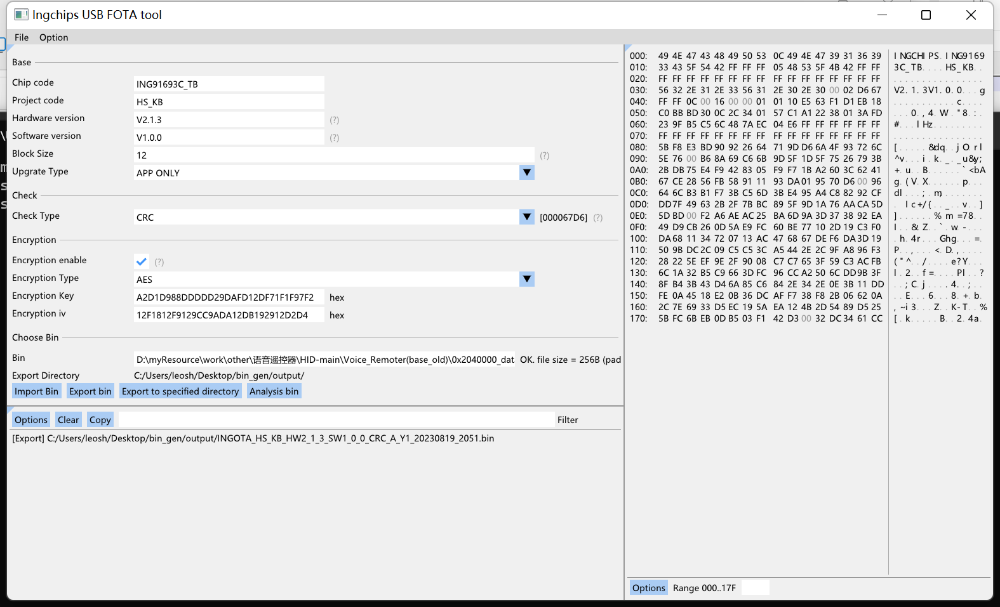

# USB FOTA bin 生成工具

## 界面介绍

整体分为三个部分：

1. 配置面板（左上）
2. 日志面板（右边）
3. 二进制预览面板（做下）

## 配置面板

包含bin文件的基本设置，校验设置和加密设置，主要有三个功能按钮

1. 导入Bin文件（导入未添加Header的Bin文件）
2. 导出生成Bin文件（生成附带Header信息的Bin文件，如果配置了加密则会对原始文件进行加密）
2. 导出生成Bin文件到指定目录（指定目录后，下一次生成Bin文件将会生成在最近一次指定的目录下），同时导出单独的IAP升级工具iap.exe
3. 验证Bin文件（对最近一次生成的Bin文件进行验证，注意：验证前请不要修改校验方式和加密设置）

## 日志面板

验证Bin文件时，会将部分信息展示出来

## 二进制预览面板

导出生成Bin文件时，会将生成的Bin文件内容以二进制的形式展示，主要为了方便观察Header信息

