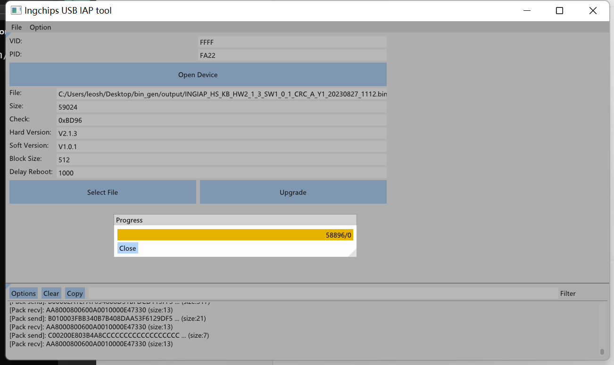

# IAP 工具

## 介绍

1. 上面三排控件用于打开指定USB设备，点击`Open Device`按钮

   打开设备后工具会查找满足特定条件的USB接口和USB端点用于后续传输数据，目前的条件是该接口是一个HID接口(Class:0x03)，并且该接口下有两个端点分别用作输入和输出

2. 中间的多数文本框（只读）是用于显示升级文件Header中的相关信息，通过点击底部的`Select File`按钮选择升级文件，信息会自动从文件的Header中解析出来，如果文件Header中的前缀和规定前缀不匹配，则文件无效

3. 打开设备并选择升级文件后，可以点击Upgrade按钮进行升级

